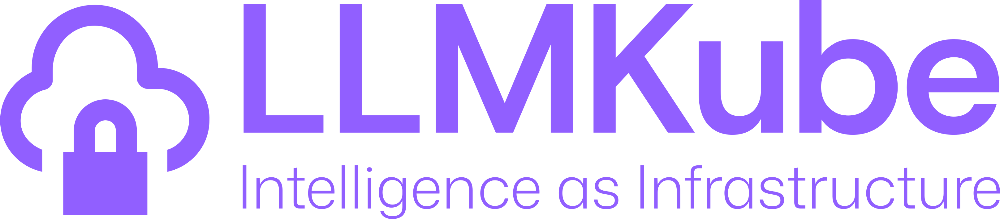
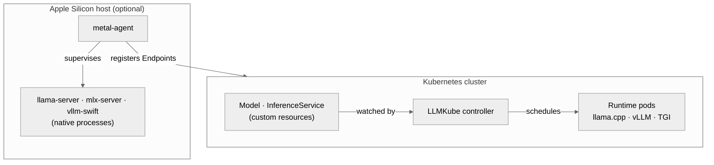
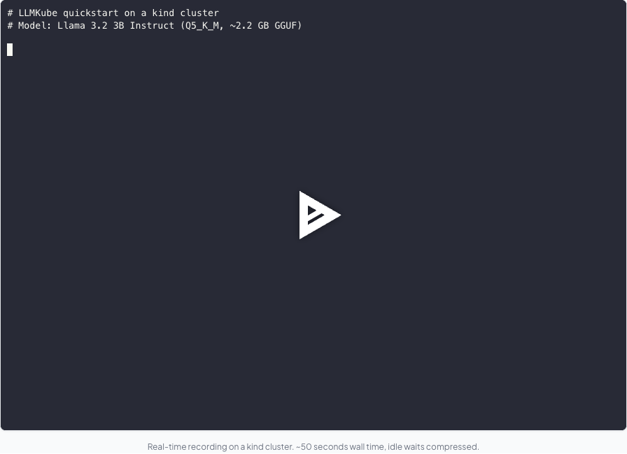

<div align="center">
  

  # LLMKube

  ### The Kubernetes operator for self-hosted LLM inference

  **Your models. Your hardware. Your rules.**

  <p>
    <a href="https://github.com/defilantech/LLMKube/actions/workflows/test.yml">
      
    </a>
    <a href="https://github.com/defilantech/LLMKube/actions/workflows/helm-chart.yml">
      
    </a>
    <a href="https://goreportcard.com/report/github.com/defilantech/llmkube">
      
    </a>
    <a href="https://github.com/defilantech/LLMKube/releases">
      
    </a>
    <a href="https://github.com/defilantech/LLMKube/stargazers">
      
    </a>
    <a href="LICENSE">
      
    </a>
    
    <a href="https://discord.gg/Ktz85RFHDv">
      
    </a>
  </p>

  <p>
    <a href="#quick-start">Quick Start</a> &bull;
    <a href="#composition-modelrouter">ModelRouter</a> &bull;
    <a href="#foreman">Foreman</a> &bull;
    <a href="#the-metal-agent">Metal Agent</a> &bull;
    <a href="#how-is-this-different">Why LLMKube?</a> &bull;
    <a href="#performance">Benchmarks</a> &bull;
    <a href="ROADMAP.md">Roadmap</a> &bull;
    <a href="https://discord.gg/Ktz85RFHDv">Discord</a>
  </p>

</div>

---

## The Problem

You want to run LLMs on your own infrastructure. Maybe it's for data privacy, cost control, air-gapped compliance, or you just don't want to send every request to OpenAI.

So you set up llama.cpp. It works great on one machine. Then you need to scale it, monitor it, manage model versions, handle GPU scheduling across nodes, expose an API, and somehow make your Mac's Metal GPU and your Linux server's NVIDIA cards work together. And the moment you want any of that traffic to *sometimes* hand off to Claude or GPT, you're building another routing layer.

Suddenly you're building an entire platform instead of shipping your product.

**LLMKube is a Kubernetes operator that turns LLM deployment into a two-line YAML problem.** Define a `Model` and an `InferenceService`, and the operator handles downloading, caching, GPU scheduling, health checks, scaling, and exposing an OpenAI-compatible API. Add a `ModelRouter` on top and the same cluster does policy-aware routing between your local models and external providers (Anthropic / OpenAI / LiteLLM) with fail-closed semantics for regulated data.

> **0.8.0 (2026-05-28)**: Foreman ships as an opt-in add-on. A Kubernetes-native control plane that dispatches coder, verifier, and reviewer agents across a heterogeneous fleet of locally-hosted LLM nodes. Foreman authored its own debut PRs against this repository ([#508](https://github.com/defilantech/LLMKube/pull/508), [#588](https://github.com/defilantech/LLMKube/pull/588)). Plus Intel oneAPI / SYCL GPU support from a first-time contributor. See [Foreman](#foreman) below or the [live Foreman docs](https://llmkube.com/docs/foreman) for the full reference.
>
> **0.7.8 (2026-05-13)**: `ModelRouter` CRD ships: cross-engine routing with per-rule and per-backend timeout budgets, half-open circuit breaker, runtime fail-closed for PII/PHI rules, configurable response-header timeout, cloud-tier connection hygiene. See [Composition: ModelRouter](#composition-modelrouter) below.

---

## Architecture

Two cooperating processes. An in-cluster controller owns Kubernetes-side desired state. An out-of-cluster `metal-agent` (optional, only needed for Apple Silicon hosts) owns OS-level process supervision and registers Endpoints back into the cluster.



Same operator manages Linux/GPU pods and Apple Silicon hosts; both surface as `InferenceService` objects to `kubectl`.

Setup guide for the metal-agent on Apple Silicon: [`deployment/macos/README.md`](deployment/macos/README.md).

---

## See it in action

[](https://llmkube.com/docs/getting-started)

*Live asciinema cast on [llmkube.com/docs/getting-started](https://llmkube.com/docs/getting-started): deploy a model on a kind cluster, stream tokens from the OpenAI-compatible endpoint, and run the built-in throughput benchmark in under a minute.*

---

## Quick Start

```bash
# Install the CLI
brew install defilantech/tap/llmkube

# Install the operator on any K8s cluster
helm repo add llmkube https://defilantech.github.io/LLMKube
helm install llmkube llmkube/llmkube --namespace llmkube-system --create-namespace

# Deploy a model (one command, uses catalog-tested defaults)
llmkube deploy phi-4-mini

# Query it (OpenAI-compatible)
kubectl port-forward svc/phi-4-mini 8080:8080 &
curl http://localhost:8080/v1/chat/completions \
  -H "Content-Type: application/json" \
  -d '{"messages":[{"role":"user","content":"Hello!"}],"max_tokens":100}'
```

That's it. The operator downloads the model, creates the deployment, sets up the service, and exposes an OpenAI-compatible API. Works with the OpenAI Python/Node/Go SDKs, LangChain, and LlamaIndex out of the box.

**Want GPU acceleration?** Add `--gpu`:

```bash
llmkube deploy llama-3.1-8b --gpu --gpu-count 1
```

<details>
<summary><b>No CLI? Use plain kubectl</b></summary>

```yaml
apiVersion: inference.llmkube.dev/v1alpha1
kind: Model
metadata:
  name: tinyllama
spec:
  source: https://huggingface.co/TheBloke/TinyLlama-1.1B-Chat-v1.0-GGUF/resolve/main/tinyllama-1.1b-chat-v1.0.Q4_K_M.gguf
  format: gguf
---
apiVersion: inference.llmkube.dev/v1alpha1
kind: InferenceService
metadata:
  name: tinyllama
spec:
  modelRef: tinyllama
  replicas: 1
  resources:
    cpu: "500m"
    memory: "1Gi"
```

```bash
kubectl apply -f model.yaml
```
</details>

**Full setup guides:** [Minikube Quickstart](docs/minikube-quickstart.md) | [GKE with GPUs](docs/gpu-setup-guide.md) | [Intel GPU Quickstart](docs/intel-gpu-quickstart.md) | [DGX Spark (MicroK8s)](docs/dgx-spark-microk8s.md) | [Air-Gapped Deployment](docs/air-gapped-quickstart.md) | [OpenShift](#troubleshooting)

---

## The Metal Agent

> **This is the thing no other Kubernetes LLM tool does.**

Most Kubernetes tools run inference inside containers. That works fine on Linux with NVIDIA GPUs. But Apple Silicon's Metal GPU can't be accessed from inside a container — so every other tool either ignores Macs or forces you into slow CPU-only inference.

LLMKube's **Metal Agent** inverts the model. Instead of stuffing inference into a container, the Metal Agent runs as a native macOS process that:

1. **Watches the Kubernetes API** for `InferenceService` resources with `accelerator: metal`
2. **Spawns `llama-server` natively** on macOS with full Metal GPU access
3. **Registers endpoints back into Kubernetes** so the rest of your cluster can route to it

Your Mac dedicates 100% of its unified memory to inference. Kubernetes handles orchestration. The same CRD works across NVIDIA, Intel, and Apple Silicon by selecting the accelerator in the model spec.

```
┌──────────────────────────────┐      ┌──────────────────────────────┐
│ Linux Server / Cloud         │      │ Mac (Apple Silicon)          │
│                              │      │                              │
│  ┌────────────────────────┐  │      │  ┌────────────────────────┐  │
│  │ Kubernetes             │  │ LAN/ │  │ Metal Agent            │  │
│  │  LLMKube Operator      │◄─┼──────┼─►│  Watches K8s API       │  │
│  │  Model Controller      │  │ VPN  │  │  Spawns llama-server   │  │
│  │  InferenceService Ctrl │  │      │  └────────────────────────┘  │
│  └────────────────────────┘  │      │                              │
│                              │      │  ┌────────────────────────┐  │
│  ┌────────────────────────┐  │      │  │ llama-server (Metal)   │  │
│  │ NVIDIA Nodes           │  │      │  │  Full GPU access       │  │
│  │  llama.cpp (CUDA)      │  │      │  │  All unified memory    │  │
│  └────────────────────────┘  │      │  └────────────────────────┘  │
└──────────────────────────────┘      └──────────────────────────────┘
```

This means you can build a heterogeneous cluster: NVIDIA GPUs in the cloud for heavy workloads, Mac Studios on-prem for low-latency inference, all managed by the same Kubernetes operator with the same CRDs.

```bash
# On your Mac
brew install llama.cpp
llmkube-metal-agent --host-ip <your-mac-ip>

# From anywhere in the cluster
llmkube deploy llama-3.1-8b --accelerator metal
```

Works over LAN, Tailscale, WireGuard, or any routable network. **[Full Metal Agent guide →](deployment/macos/README.md)**

---

## Composition: ModelRouter

`Model` and `InferenceService` give you self-hosted inference. `ModelRouter` puts a policy-aware OpenAI-compatible endpoint in front of *both* your local InferenceServices and external providers, with budgets, classifications, and fail-closed semantics enforced at the cluster level instead of in application code.

The motivating use case: an agent running on a local model can selectively hand off specific steps to Claude or GPT without the agent code knowing or caring where the model lives, while platform policy enforces that regulated data never egresses.

```yaml
apiVersion: inference.llmkube.dev/v1alpha1
kind: ModelRouter
metadata:
  name: coding-router
spec:
  backends:
    - name: local-coder
      inferenceServiceRef: { name: qwen3-coder }
      tier: local
      capabilities: [code, tools]
    - name: cloud-opus
      external:
        provider: anthropic
        model: claude-opus-4-7
        credentialsSecretRef: { name: anthropic-key }
      tier: cloud
  rules:
    - name: pii-stays-local
      match: { dataClassification: [pii] }
      route: { backends: [local-coder] }
      failClosed: true
      timeout: 8s
    - name: complex-to-cloud
      match: { taskComplexity: complex }
      route:
        backends: [cloud-opus, local-coder]
        strategy: primary-fallback
      timeout: 90s
  defaultRoute: local-coder
```

Three properties worth calling out:

- **Fail-closed for regulated data, both statically and at runtime.** Apply-time validation rejects rules that would route PII / PHI to cloud-tier backends. Runtime enforcement refuses with HTTP 503 if the local pool can't serve the request, never falling through to cloud.
- **Per-rule and per-backend timeout budgets.** Strict policy tiers fast-fail; lenient tiers stay patient. The proxy applies `context.WithTimeout` per attempt, so a slow primary doesn't eat the fallback's budget. Resolution order: `rule.timeout || backend.timeout || proxy default`.
- **OpenAI-compatible streaming endpoint.** Plug it into LangGraph, OpenAI Agents SDK, Anthropic SDK, Cline, Aider, or any framework that speaks the OpenAI API. The agent runtime doesn't need to know it's talking to a router.

**[Full ModelRouter concept doc →](docs/site/concepts/model-router.md)** | **[Sample manifest](config/samples/inference_v1alpha1_modelrouter.yaml)**

---

## Foreman


`Model` and `InferenceService` give you self-hosted inference. `ModelRouter` gives you policy-aware routing. **Foreman gives you an orchestrator for agentic workloads on top of both.**

Foreman is an opt-in add-on that ships its own Helm chart, its own API group (`foreman.llmkube.dev`), and its own controller and node-agent binaries. It introduces four CRDs (`Workload`, `AgenticTask`, `Agent`, `FleetNode`), a capability-aware scheduler, and a native Go agent loop that runs OpenAI function-calling against your local inference endpoints. The v0.1 shape is a linear pipeline: coder agent on one node produces a branch, verifier agent (gate) on another node runs `make fmt vet lint test`, reviewer agent(s) on a third node read the diff against the issue body and score it.

```yaml
apiVersion: foreman.llmkube.dev/v1alpha1
kind: Workload
metadata:
  name: fix-small-bugs
  namespace: default
spec:
  intent: "Fix small open issues"
  repo: defilantech/LLMKube
  issues: [510, 526, 449]
  coderAgentRef:    { name: qwen36-35b-carnice-mtp-coder }
  verifierAgentRef: { name: shadowstack-gate }
  reviewerAgentRefs:
    - { name: qwen36-35b-a3b-reviewer }
    - { name: devstral-24b-reviewer }
```

`kubectl apply` and watch the fleet land DCO-signed branches on a fork. Two such branches reached this repository as upstream PRs: [#508](https://github.com/defilantech/LLMKube/pull/508) and [#588](https://github.com/defilantech/LLMKube/pull/588).

Foreman is meant for shops where on-prem hardware, sovereignty constraints, or sheer batch scale make the agentic-coding cloud-API model a poor fit. It is not a replacement for individual-developer tools like Cursor or aider; it is the control plane *below* those tools, for when you want a fleet doing the work instead of one developer.

**[Full Foreman docs →](https://llmkube.com/docs/foreman)** | **[Model compatibility table](https://llmkube.com/docs/foreman/model-compatibility)** | **[Sample manifests](examples/foreman/)**

---

## How Is This Different?

| | **LLMKube** | **vLLM / TGI** | **Ollama** | **KServe** | **LocalAI** |
|---|---|---|---|---|---|
| **Kubernetes-native CRDs** | Yes | No (manual Deployments) | No | Yes | No |
| **Apple Silicon Metal GPU** | Native (Metal Agent) | No | Local only | No | CPU only |
| **NVIDIA GPU** | Yes | Yes | Limited | Yes | Yes |
| **Heterogeneous clusters** (NVIDIA + Metal) | Yes | No | No | No | No |
| **Hybrid local + cloud routing with policy** | `ModelRouter` CRD | No | No | No | No |
| **Fail-closed for regulated data (PII/PHI)** | Static + runtime, K8s-enforced | No | No | No | No |
| **Per-rule / per-backend timeout budgets** | Yes (`spec.rules[].timeout`) | No | No | No | No |
| **OpenAI-compatible API** | Built-in | Yes | Yes | Requires config | Yes |
| **Model catalog + CLI** | `llmkube deploy llama-3.1-8b` | Manual | `ollama pull` | Manual | Manual |
| **GPU queue management** | Priority classes, queue position | No | No | No | No |
| **Air-gap / edge ready** | Yes | Possible | Possible | Yes | Yes |
| **Observability** | Prometheus + Grafana included | External | No | External | No |

**LLMKube is for teams that want Kubernetes-managed LLM inference across heterogeneous hardware.** If you just need to run a model on one machine, Ollama is simpler. If you need maximum throughput on NVIDIA-only clusters, vLLM is faster. LLMKube occupies the space where Kubernetes orchestration, multi-hardware support, and operational simplicity intersect.

**Versus newer adjacent projects:**
- **KubeAI**: similar Kubernetes-operator scope. KubeAI focuses on autoscaling vLLM/Ollama on NVIDIA, intra-cluster. LLMKube adds first-class Apple Silicon Metal support, GGUF + HF runtime mixing, a model catalog CLI, and `ModelRouter` for policy-aware *hybrid* routing across local + cloud.
- **llm-d**: distributed inference for very large models on NVIDIA fleets via Gateway API. Different problem space. LLMKube targets heterogeneous on-prem clusters (laptops, edge nodes, single GPUs) where llm-d's distributed-NVIDIA-first design is overkill.
- **LiteLLM**: dominant cloud-provider proxy, operates outside Kubernetes policy. LLMKube doesn't replace LiteLLM — `ModelRouter` composes with it: declare a `provider: litellm` backend pointed at a running LiteLLM proxy and the platform-level fail-closed gate sits in front.

---

## Performance

Real benchmarks, real hardware:

### Cloud GPU (GKE, NVIDIA L4)

| Metric | CPU | GPU (NVIDIA L4) | Speedup |
|--------|-----|-----------------|---------|
| Token generation | 4.6 tok/s | **64 tok/s** | **17x** |
| Prompt processing | 29 tok/s | **1,026 tok/s** | **66x** |
| Total response time | 10.3s | **0.6s** | **17x** |

### Desktop GPU (Dual RTX 5060 Ti)

| Model | Size | Tokens/s | P50 Latency | P99 Latency |
|-------|------|----------|-------------|-------------|
| Llama 3.2 3B | 3B | **53.3** | 1930ms | 2260ms |
| Mistral 7B v0.3 | 7B | **52.9** | 1912ms | 2071ms |
| Llama 3.1 8B | 8B | **52.5** | 1878ms | 2178ms |

Consistent ~53 tok/s across 3-8B models with automatic layer sharding. See [v0.4 release notes](docs/releases/RELEASE_NOTES_v0.4.0.md) for the full multi-GPU benchmark suite.

---

## Features

**Inference:**
- Kubernetes-native CRDs (`Model` + `InferenceService`)
- Multiple runtimes: llama.cpp (GGUF), vLLM (HuggingFace + safetensors), TGI in-cluster; llama-server, mlx-server, and vllm-swift natively on Apple Silicon
- Automatic model download from HuggingFace, HTTP, or PVC (S3 planned)
- Persistent model cache, download once, deploy instantly ([guide](docs/MODEL-CACHE.md))
- OpenAI-compatible `/v1/chat/completions` API
- Multi-replica horizontal scaling with scale subresource support (`kubectl scale`, KEDA)
- License compliance scanning for GGUF models

**Routing & policy ([ModelRouter](#composition-modelrouter)):**
- `ModelRouter` CRD: one OpenAI-compatible endpoint, multiple backends (local InferenceServices + external Anthropic / OpenAI / Bedrock / LiteLLM)
- Policy-aware rules: data classification, task complexity, required capabilities, arbitrary header match
- Fail-closed semantics for regulated data: static (apply-time) + runtime (HTTP 503, no cloud egress)
- Per-rule and per-backend timeout budgets (`spec.rules[].timeout` / `spec.backends[].timeout`)
- Half-open circuit breaker with configurable quarantine window
- Audit log on every request: rule, backend, tier, resolved timeout, outcome
- Streaming SSE passthrough from day one

**GPU:**
- NVIDIA CUDA (T4, L4, A100, RTX)
- Intel GPU (i915 or xe plugin resources) with llama.cpp SYCL backend
- Apple Silicon Metal via [Metal Agent](deployment/macos/) (M1-M4)
- Multi-GPU inference for 13B-70B+ models ([guide](docs/MULTI-GPU-DEPLOYMENT.md))
- Automatic layer offloading and tensor splitting
- GPU queue management with priority classes
- DRA passthrough (resource.k8s.io/v1) for CRI-based device scheduling (Kubernetes 1.34+)

**Operations:**
- Full CLI: `llmkube deploy/list/status/delete/catalog/cache/queue`
- Model catalog with 10+ pre-configured models
- Prometheus metrics + OpenTelemetry tracing
- Grafana dashboards for GPU and inference monitoring
- GPU metrics (utilization, temp, power, memory)
- SLO alerts (GPU health, service availability)
- Custom CA certificates for corporate environments
- Multi-cloud Terraform (GKE, AKS, EKS)
- Cost optimization (spot instances, auto-scale to zero)

---

## Use the API

Every deployment exposes an OpenAI-compatible API. Use any OpenAI SDK:

```python
from openai import OpenAI

client = OpenAI(
    base_url="http://llama-3b-service:8080/v1",
    api_key="not-needed"
)

response = client.chat.completions.create(
    model="llama-3b",
    messages=[{"role": "user", "content": "Explain Kubernetes in one sentence"}]
)
```

Works with LangChain, LlamaIndex, and any OpenAI-compatible client library.

---

## Installation

### Helm (Recommended)

```bash
helm repo add llmkube https://defilantech.github.io/LLMKube
helm install llmkube llmkube/llmkube --namespace llmkube-system --create-namespace
```

### CLI

```bash
# macOS
brew install defilantech/tap/llmkube

# Linux / macOS
curl -sSL https://raw.githubusercontent.com/defilantech/LLMKube/main/install.sh | bash
```

### From Source

```bash
git clone https://github.com/defilantech/LLMKube.git && cd LLMKube
make install  # Install CRDs
make run      # Run controller locally
```

[Helm Chart docs](charts/llmkube/README.md) | [Minikube Quickstart](docs/minikube-quickstart.md) | [GKE GPU Setup](docs/gpu-setup-guide.md)

---

## Troubleshooting

<details>
<summary><b>Model won't download</b></summary>

```bash
kubectl describe model <model-name>
kubectl logs <pod-name> -c model-downloader
```
Common causes: HuggingFace URL needs auth (use direct links), insufficient disk space, network timeout (auto-retries).
</details>

<details>
<summary><b>Pod OOM crash</b></summary>

```bash
llmkube deploy <model> --memory 8Gi  # Rule of thumb: file size x 1.2
```
</details>

<details>
<summary><b>GPU not detected</b></summary>

```bash
kubectl get pods -n gpu-operator-resources
kubectl get pods -n kube-system -l name=nvidia-device-plugin-ds
```
</details>

<details>
<summary><b>OpenShift / MicroShift / OKD: ship the bundled Helm preset</b></summary>

LLMKube is tested in CI against MicroShift to verify the OpenShift SCC admission path end-to-end on every PR. The repo ships a Helm values preset at `charts/llmkube/values-openshift.yaml` that disables the operator's default `fsGroup` so the `restricted-v2` SCC can inject an appropriate value from the namespace's allocated supplemental-groups range.

**Recommended install:**

```bash
helm install llmkube ./charts/llmkube \
  -f charts/llmkube/values-openshift.yaml \
  -n llmkube-system --create-namespace
```

That single command produces an LLMKube deployment whose InferenceService pods are admitted cleanly under `restricted-v2`. The same `values-openshift.yaml` works on MicroShift, OKD, OpenShift Container Platform, and any other distribution that runs the SCC admission controller with the standard `MustRunAs` fsGroup strategy.

**Per-InferenceService override (fallback for single-tenant cases).**

If you would rather pin `fsGroup` per workload instead of disabling the default operator-wide:

```bash
# Find your namespace's supplemental-groups range
oc get namespace <namespace> -o jsonpath='{.metadata.annotations.openshift\.io/sa\.scc\.supplemental-groups}'
```

```yaml
apiVersion: inference.llmkube.dev/v1alpha1
kind: InferenceService
metadata:
  name: my-service
spec:
  modelRef: my-model
  podSecurityContext:
    fsGroup: 1000680000  # first value from the command above
```

**What the preset does, in one line.** Sets `controllerManager.initContainer.defaultFSGroup: 0` so the SCC admission controller is the authoritative source of `fsGroup`, not the operator's default of 102 (which is correct for non-OpenShift clusters and would be rejected by `restricted-v2`).
</details>

---

## Contributing

We welcome contributions. See [CONTRIBUTING.md](CONTRIBUTING.md) for the full guide.

**Good first issues:**
- Documentation and tutorials
- Model catalog additions
- Testing on different K8s platforms
- Example applications (chatbot UI, RAG pipeline)

**Advanced:**
- K3s edge deployment
- SafeTensors format support
- Multi-node GPU sharding for 70B+ models

### Contributors

Thanks to the people who've shipped code, tests, and docs:

<a href="https://github.com/defilantech/LLMKube/graphs/contributors">
  
</a>

---

## Community

- **Chat:** [Discord](https://discord.gg/Ktz85RFHDv)
- **Bug reports & features:** [GitHub Issues](https://github.com/defilantech/LLMKube/issues)
- **Questions & discussion:** [GitHub Discussions](https://github.com/defilantech/LLMKube/discussions)
- **Roadmap:** [ROADMAP.md](ROADMAP.md)

---

## Acknowledgments

Built on [Kubebuilder](https://kubebuilder.io), [llama.cpp](https://github.com/ggml-org/llama.cpp), [Prometheus](https://prometheus.io), and [Helm](https://helm.sh).

## License

Apache 2.0 — see [LICENSE](LICENSE).

## Trademarks

LLMKube is not affiliated with or endorsed by the Cloud Native Computing Foundation or the Kubernetes project. Kubernetes is a registered trademark of The Linux Foundation. All other trademarks are the property of their respective owners.

<div align="center">

**[Get started in 5 minutes →](docs/minikube-quickstart.md)**

If LLMKube is useful to you, **[a star helps others find it](https://github.com/defilantech/LLMKube)**.

</div>
